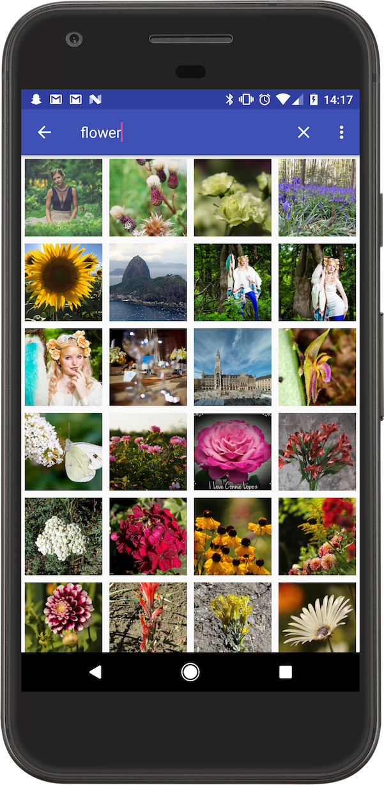

Flickr Saver
============

Sample for Seesaw Android Project.

Getting Started
---------------
1. Download the code.
2. Open the code in Android Studio.
3. Run the app.

Strategy
--------

1. RecyclerView withe GridLayoutManager for displaying the images
2. Constrain the images to be square using ConstraintLayout.
3. Use Retrofit to query the Flickr API.
4. GSON for parsing the JSON response into a custom Java object.
5. Build the URL and use Glide to load the images into the RecyclerView
6. Use a progress bar to show loading state together with Glide's
RequestListener Interface.
7. Save the instance state on rotation.
8. Add a custom item at the end of the list which is used in BindViewHolder to
load more items (the next page).
9. Glide handles image performance and caching.
10. Use the MediaStore content provider to save the image and make it available
externally to other apps.
11. Use a singleTop launch mode for the search activity to preserve the search
when navigating back from the Detail view.

Issues
------
1. When scrolling really quickly, sometimes Glide messes up the order of the
items, and you have to scroll up and down to reorder correctly.
2. No screen or feedback to show how many results left, and no informative error
 message if the API yields no results.
3. No data persistence.
4. Didn't check for backwards compat.

Potential Improvements
----------------------
1. SQLLite or SharedPreferences for persistence
2. A lot of work could be done to make the UI more intuitive
3. Better error handling (more informative to user)
